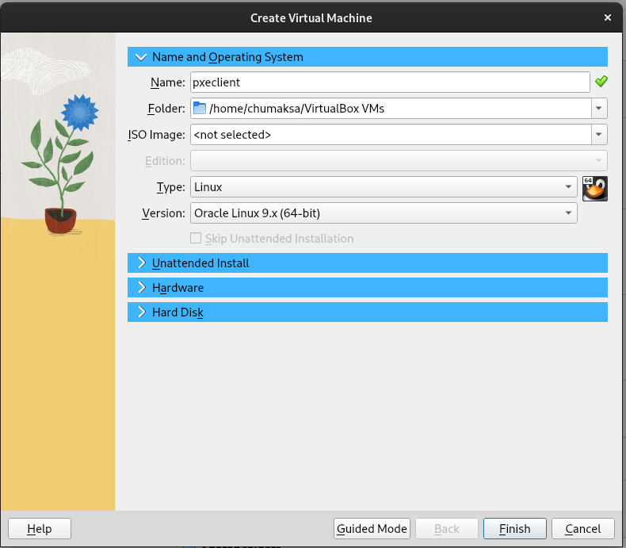
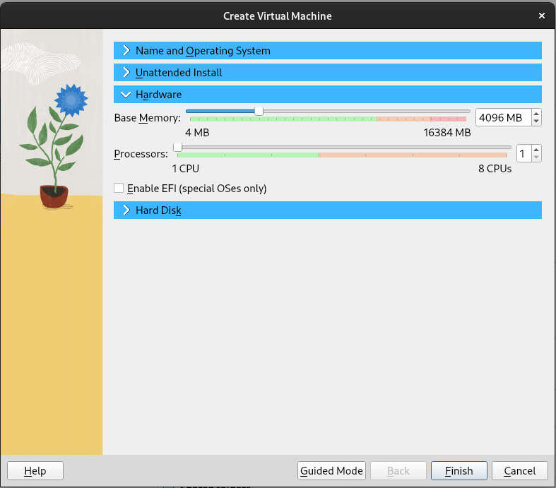
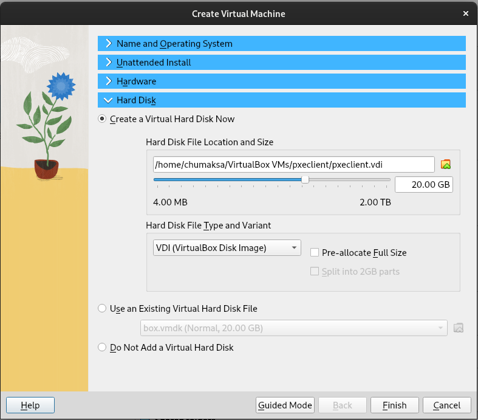

# otus-task19

# Настройка PXE сервера для автоматической установки

### Решение

Сервером будет выступать vm с almalinux 9. \
Для внутренней сети (для PXE клиентов) будем использовать сетевой интерфейс с IP - 10.0.0.20. \
Для управления и настройкой сервера с помощью Ansible будем использовать сетевой интерфейс с IP - 192.168.56.60. \
Развернём сервер с помощью Vagrant файла следующего содержания:
```

# -*- mode: ruby -*-
# vi: set ft=ruby :

Vagrant.configure("2") do |config|

config.vm.define "pxeserver" do |server|
  server.vm.box = 'almalinux/9'

  server.vm.host_name = 'pxeserver'
  server.vm.network :private_network, 
                     ip: "10.0.0.20", 
                     virtualbox__intnet: 'pxenet'
  server.vm.network :private_network, 
  		     ip: "192.168.56.60", 
  		     adapter: 3

  server.vm.provider "virtualbox" do |vb|
    vb.memory = "4096"
    vb.customize ["modifyvm", :id, "--natdnshostresolver1", "on"]
  end
  
  end

end
```

Сервер будем настраивать с помощью Ansible. \
В качестве web сервера используем Nginx. \
Сервер подготавливаем для разворачивания клиентов с последней версией диструбутива AlmaLinux. \
Итоговый playbook выглядит следующим образом:
```

---
- name: Set up PXE server
  hosts: servers
  become: true
  vars:
    nginx_listen_port: 8080

  tasks:
    - name: Install nginx
      package:
        name: nginx
        state: latest
        update_cache: true

    - name: Install tftp-server
      package:
        name: tftp-server
        state: latest
        update_cache: true

    - name: Install dhcp-server
      package:
        name: dhcp-server
        state: latest
        update_cache: true 
        
    - name: Download ISO image AlmaLinux-9-latest
      get_url:
        url: http://mirror.yandex.ru/almalinux/9.3/isos/x86_64/AlmaLinux-9-latest-x86_64-boot.iso
        dest: ~/AlmaLinux-9-latest-x86_64-boot.iso
        mode: '0755'
        
    - name: Create ISO directory
      file:
        path: /usr/share/iso
        state: directory
        mode: '0755'        
                       
    - name: Mount ISO image
      mount:
        path: /mnt
        src: /root/AlmaLinux-9-latest-x86_64-boot.iso
        fstype: iso9660
        opts: ro,loop
        state: mounted
                       
    - name: copy ALL files from /mnt to /usr/share/iso
      copy:
        src: /mnt/
        dest: /usr/share/iso
        remote_src: yes 
        directory_mode: yes                       
                       
    - name: Create nginx config file from template
      template:
        src: templates/nginx.conf.j2
        dest: /etc/nginx/nginx.conf
      notify:
        - Reload nginx
        
    - name: Create TFTP directory
      file:
        path: /var/lib/tftpboot/pxelinux.cfg
        state: directory
        mode: '0755'        

    - name: Set up pxelinux
      template:
        src: default
        dest: /var/lib/tftpboot/pxelinux.cfg/default
        owner: root
        group: root
        mode: '0644'

    - name: Install syslinux
      package:
        name: syslinux
        state: latest
        update_cache: true

    - name: Copy syslinux files to TFTP share
      copy:
        src: /usr/share/syslinux/{{ item }}
        dest: /var/lib/tftpboot/{{ item }}
        mode: '0644'
        remote_src: true
      with_items:
        - pxelinux.0
        - ldlinux.c32
        - libmenu.c32
        - libutil.c32
        - menu.c32
        - vesamenu.c32

    - name: Copy initrd and vmlinuz files to TFTP share
      copy:
        src: /usr/share/iso/images/pxeboot/{{ item }}
        dest: /var/lib/tftpboot/{{ item }}
        mode: '0755'
        remote_src: true
      with_items:
        - initrd.img
        - vmlinuz

    - name: Restart tftp-server
      service:
        name: tftp.service
        state: restarted
        enabled: true

    - name: Set up dhcp-server
      template:
        src: dhcpd.conf
        dest: /etc/dhcp/dhcpd.conf
        mode: '0644'

    - name: Restart dhcp-server
      service:
        name: dhcpd
        state: restarted
        enabled: true

  handlers:
    - name: Restart nginx
      service:
        name: nginx
        state: restarted
        enabled: yes

    - name: Reload nginx
      service:
        name: nginx
        state: reloaded
```

После выполнения ansible playbook наш сервер полностью готов к работе и ждёт подключения к нему клиентов.
```

PLAY [Set up PXE server] ******************************************************************************************************************************************************************************************

TASK [Gathering Facts] ********************************************************************************************************************************************************************************************
ok: [pxeserver]

TASK [Install nginx] **********************************************************************************************************************************************************************************************
ok: [pxeserver]

TASK [Install tftp-server] ****************************************************************************************************************************************************************************************
ok: [pxeserver]

TASK [Install dhcp-server] ****************************************************************************************************************************************************************************************
ok: [pxeserver]

TASK [Download ISO image AlmaLinux-9-latest] **********************************************************************************************************************************************************************
changed: [pxeserver]

TASK [Create ISO directory] ***************************************************************************************************************************************************************************************
ok: [pxeserver]

TASK [Mount ISO image] ********************************************************************************************************************************************************************************************
changed: [pxeserver]

TASK [copy ALL files from /mnt to /usr/share/iso] *****************************************************************************************************************************************************************
changed: [pxeserver]

TASK [Create nginx config file from template] *********************************************************************************************************************************************************************
changed: [pxeserver]

TASK [Create TFTP directory] **************************************************************************************************************************************************************************************
changed: [pxeserver]

TASK [Set up pxelinux] ********************************************************************************************************************************************************************************************
changed: [pxeserver]

TASK [Install syslinux] *******************************************************************************************************************************************************************************************
changed: [pxeserver]

TASK [Copy syslinux files to TFTP share] **************************************************************************************************************************************************************************
changed: [pxeserver] => (item=pxelinux.0)
changed: [pxeserver] => (item=ldlinux.c32)
changed: [pxeserver] => (item=libmenu.c32)
changed: [pxeserver] => (item=libutil.c32)
changed: [pxeserver] => (item=menu.c32)
changed: [pxeserver] => (item=vesamenu.c32)

TASK [Copy initrd and vmlinuz files to TFTP share] ****************************************************************************************************************************************************************
changed: [pxeserver] => (item=initrd.img)
changed: [pxeserver] => (item=vmlinuz)

TASK [Restart tftp-server] ****************************************************************************************************************************************************************************************
changed: [pxeserver]

TASK [Set up dhcp-server] *****************************************************************************************************************************************************************************************
changed: [pxeserver]

TASK [Restart dhcp-server] ****************************************************************************************************************************************************************************************
changed: [pxeserver]

RUNNING HANDLER [Reload nginx] ************************************************************************************************************************************************************************************
changed: [pxeserver]

PLAY RECAP ********************************************************************************************************************************************************************************************************
pxeserver                  : ok=18   changed=13   unreachable=0    failed=0    skipped=0    rescued=0    ignored=0
```

Для проверки в VirtualBOX создаём новую виртуальную машину (pxeclient). \



